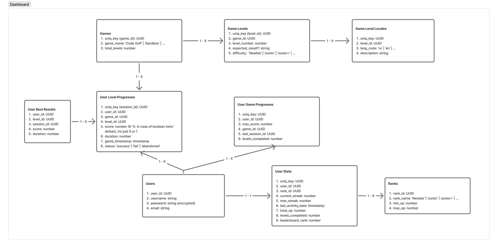
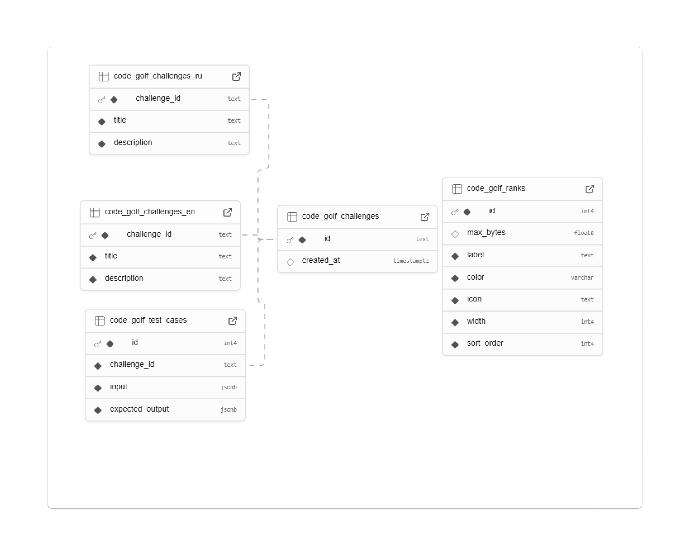

28.02.2026

### Сделал деплой на Netlify и Vercel
Так уж получилось что задеплоил сразу на два сервиса. На gh-pages не работал роутинг от Ангуляра и пришлось оттуда уйти.  
На Netlify понадобился небольшой конфиг. На Vercel просто доступ к репозиторию.  
В обоих случаях важно указать путь к билду `dist/rs-tandem/browser`. На Ангуляре без этого не работает. Или, может быть, можно ещё в конфиге ангуляра пути изменить.  
3 часа на деплой ушло.

### Созвон с командой на 2 часа. Нужно познакомится с SQL базами данных
Обсудили кто что делает, новые задачи появились. 
На созвоне все говорят что надо решать какие данных храним по нашим играм, а я даже не понимаю что означают схемаы которые уже кто-то сделал.   
Что значит когда ключ одной таблицы связан с другой? Что делает ключ? Как это когда "ключи связаны"? "Поля должны состыковыватся" это как? Что это даёт? Ничего не понятно.

### Что дальше:
- Разобраться как работают SQL базы данных. 
- Наконец продолжить делать компонент Async Sorter. Уже давно там ничего нового не добавлялось.

Непонятные схемы: 

