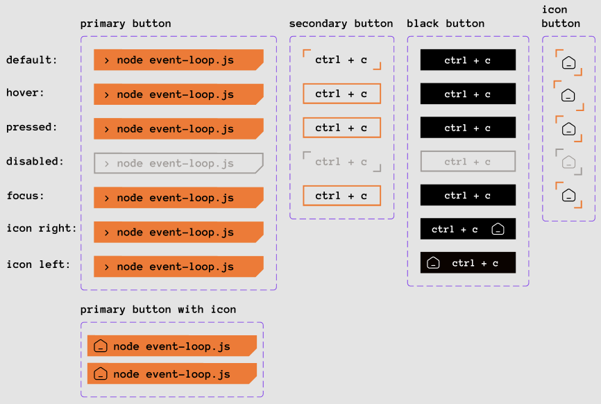
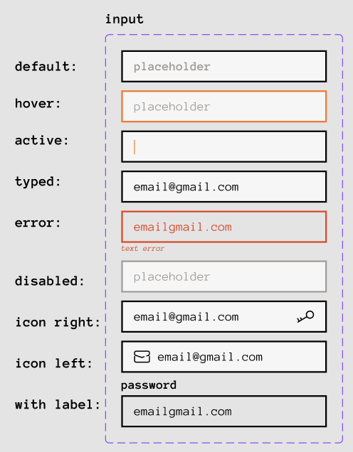
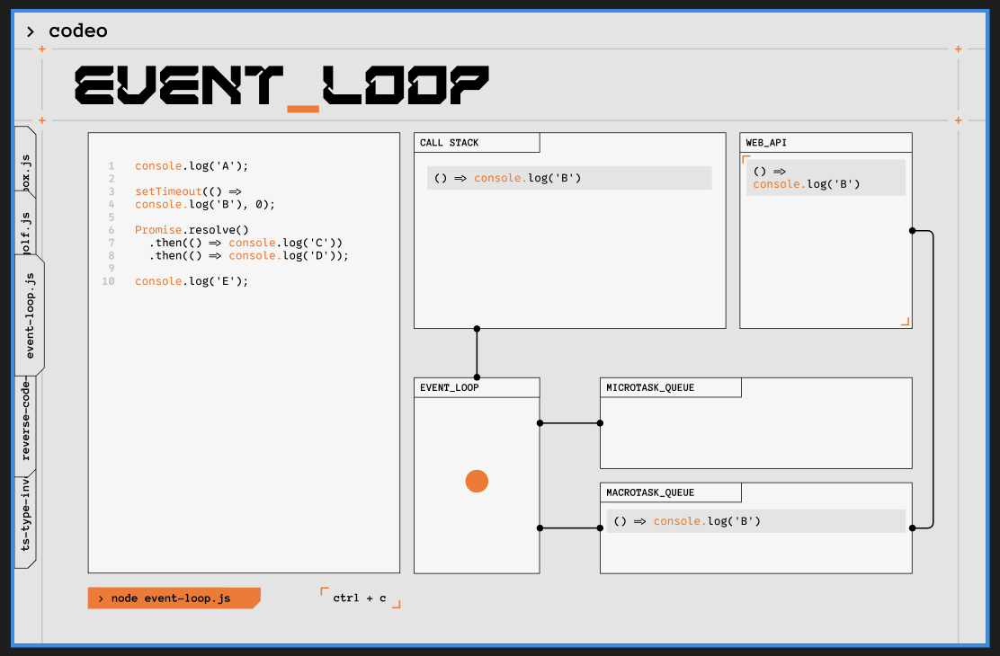

# Дата: 24.02.2026

**Описание**  
Последние несколько дней словил фокус на дизайне, так как ребята уже начинают писать свои страницы. Не хочу чтобы наши старания по написанию приложения не было оценены по достоинству из-за разноненности в дизайне страниц приложения. 
Много времени занимался поиском подходяших референсов, после сделал дизайн для страницы Event Loop, и некоторых компонентов: кнопки, инпуты. Единственное я не прорабатывал состояния кнопок при нвоедении, фокусе и т.д. Решил сделать это уже в процессе кодинга

1. **Кнопки**    

2. **Инпут**   

3. **Event Loop page**  

**Затраченное время:** 15 часов
