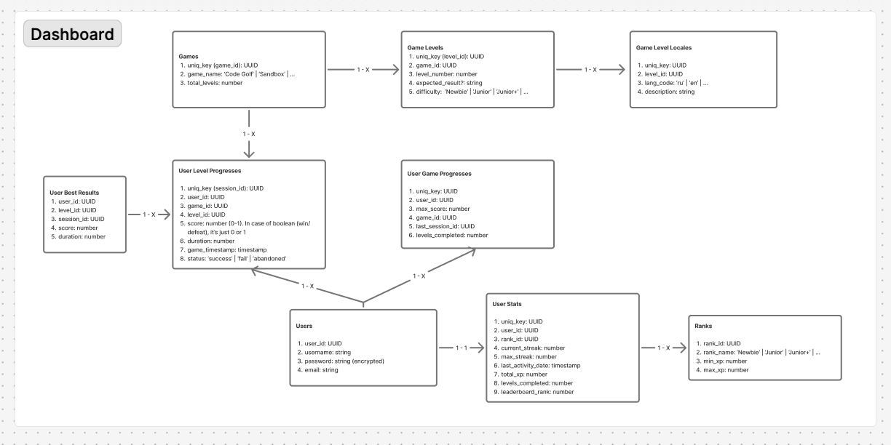
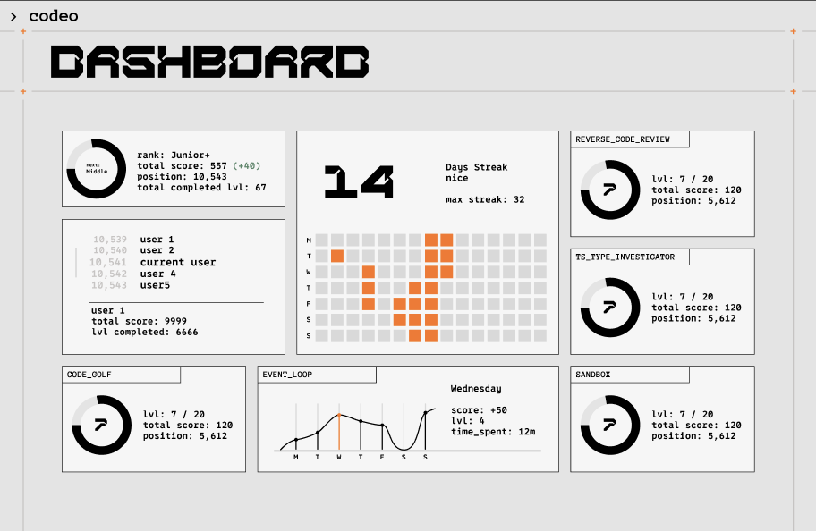
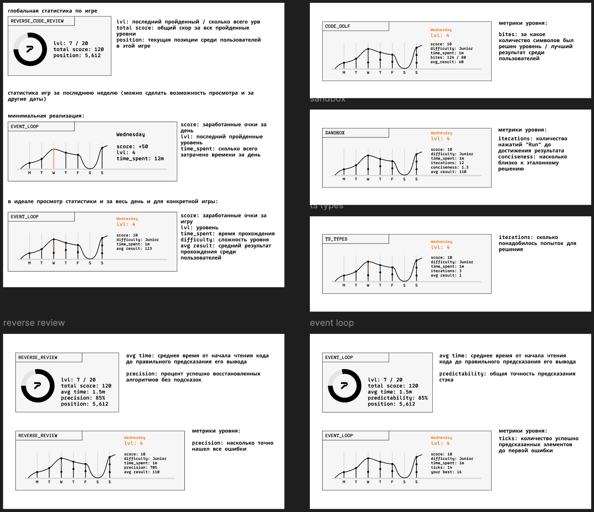
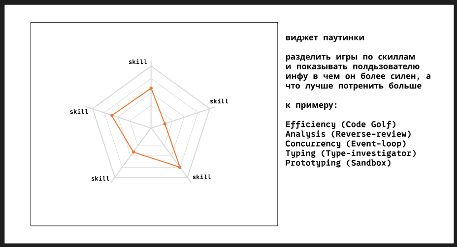

# Дата: 21.02.2026

### Описание
Раздумывал пол дня о дашборде. Думал о том какие данные мог бы отображать дашборд по всем играм. Оказалось не очень легко. Бкз понимания того как игры в итоге будут реализовывать и какие метрики будут собирать. Чтобы примерно понять проанализировал похожие приложения: LeetCode, Codewars, code.golf и тп. Это послужило основой для моих рассуждений, но не сильно помогло. так как у нас на одной платформе несколько игр и как я понял данные у нас будут унифиуированы и не знаю насколько команда готова писать бек под свои игры.  

**Добавил в таблицу БД унифицированнцю статистику пользователя:**  
  

### Dashboard
Также в фигме сделал варфрейм дашборда, чтобы команда смогла визуально посмотреть какие данные какой виджет у меня ожидает.  
Сделал как и унифицированный вариант, так и внес свои предложения по метрикам, которые может собирать игра для показа на дашборде  

**Варфрейм страницы**:  
  

**Предложения по метрикам унифицированные / отдкльно для каждой игры**:  

**Вариант виджета**:  
  

**Затраченное время:** 6 часов
