# TNDM UI Kit

A library of reusable, high-performance UI components for the TNDM project. Built with **Angular Signals** and **OnPush** strategy.

---

## Table of Contents

- [Form Components](#form-components)
  - [General Principles](#general-principles)
  - [TndmInput](#tndminputcomponent)
  - [TndmCheckbox](#tndmcheckboxcomponent)
- [Action Components](#action-components)
  - [TndmButton](#tndmbuttoncomponent)
  - [TndmToaster & ToastService](#tndmtoaster-&-toastservice)
- [Shared Types](#shared-types)

---

## Form Components

### Form Integration Example

The UI Kit components are designed to work together within a single `FormGroup`. Use standard Angular Reactive Forms features like `Validators.requiredTrue` for checkboxes or custom `Validators` for inputs.

### Usage in a Component

```typescript
// app.component.ts
protected profileForm = new FormGroup({
  userName: new FormControl('', [Validators.required, Validators.minLength(4)]),
  email: new FormControl('', [Validators.email]),
  agreeToTerms: new FormControl(false, [Validators.requiredTrue]) // Must be true to pass
});
```

### Usage in Template

```html
<form [formGroup]="profileForm" (ngSubmit)="save()">
  <tndm-input formControlName="userName" id="user" name="username" label="User Account"> </tndm-input>

  <tndm-checkbox formControlName="agreeToTerms" id="terms" name="terms" label="I accept the terms and conditions">
  </tndm-checkbox>

  <!-- Button automatically reacts to form status -->
  <tndm-button
    [btnConfig]="{ 
      label: 'Submit Profile', 
      isDisabled: profileForm.invalid || profileForm.pending 
    }"
    type="submit">
  </tndm-button>
</form>
```

### TndmInput

A versatile text field supporting various HTML5 input types and validation states.

#### Validation Priority

Error messages are resolved in the following order:

1. **Custom Message** — from `errorMessages` input
2. **Default Message** — fallback from `DEFAULT_ERROR_MESSAGES` constant

#### Visual States

| Default                                                | With Label                                                | With Icon                                                | Typed                                                | Focus/Hover                                          | Error State                                          | Disabled                                                |
| :----------------------------------------------------- | :-------------------------------------------------------- | :------------------------------------------------------- | :--------------------------------------------------- | :--------------------------------------------------- | :--------------------------------------------------- | :------------------------------------------------------ |
| 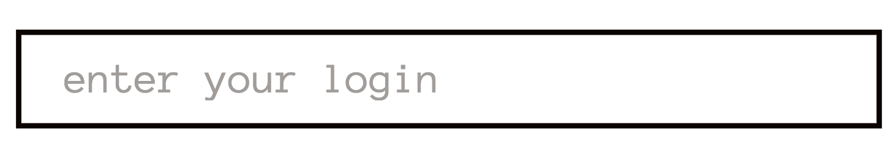 | 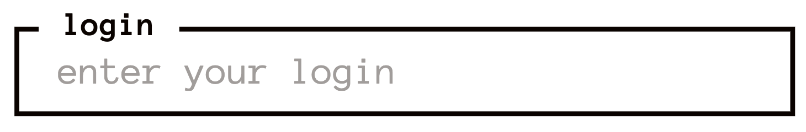 | 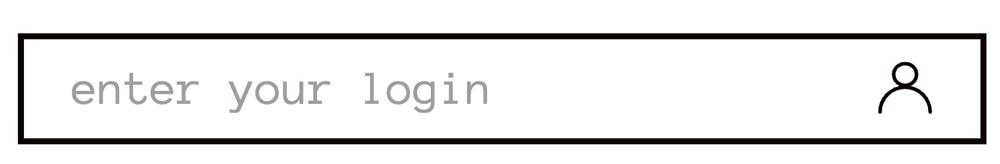 | 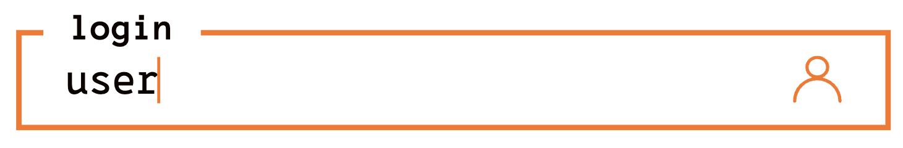 | 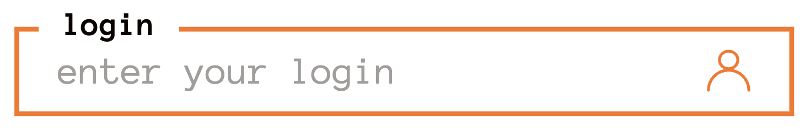 | 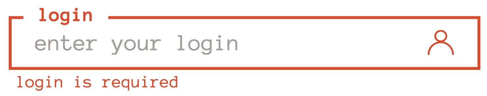 | 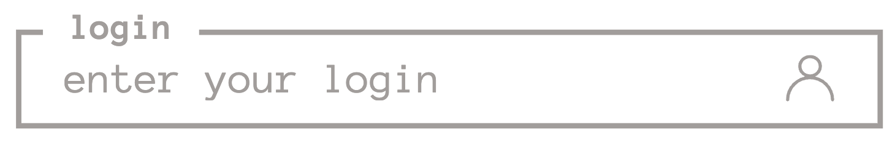 |

#### API (Inputs)

| Property        | Type                                     | Required | Default | Description                                                                |
| --------------- | ---------------------------------------- | -------- | ------- | -------------------------------------------------------------------------- |
| `id`            | `string`                                 | ✅       | —       | Unique identifier for label/input binding                                  |
| `name`          | `string`                                 | ✅       | —       | Field name used for generating error messages                              |
| `label`         | `string`                                 | ❌       | `null`  | Text label displayed above the input                                       |
| `type`          | [`InputType`](#shared-types)             | ❌       | `text`  | HTML input type (email, password, etc.)                                    |
| `placeholder`   | `string`                                 | ❌       | `null`  | Ghost text displayed inside the field                                      |
| `icon`          | [`IconType`](#shared-types)              | ❌       | `null`  | Icon name from the internal library                                        |
| `errorMessages` | [`ValidationMessages<T>`](#shared-types) | ❌       | `{}`    | Custom error overrides (Static string or ErrorGenerator<T>)                |
| `trimmed`       | `boolean`                                | ❌       | `false` | If true, automatically removes leading/trailing whitespace on every change |

#### API (Reactive Forms)

The component implements ControlValueAccessor, meaning it integrates directly with formControlName or [formControl]. When trimmed is enabled, the underlying form control will always receive a sanitized string

#### Usage

```html
<tndm-input formControlName="email" id="user-email" name="email" type="email" icon="email" [trimmed]="true">
</tndm-input>
```

### Advanced Validation Usage

The component supports dynamic error messages via `ErrorGenerator`. This allows you to use data returned by validators (like `requiredLength` or custom `requirements`).

1. Define your Error Map:

```typescript
interface CustomContext {
  requirements: string[];
}

const PASS_ERRORS: ValidationMessages<CustomContext> = {
  // context is typed based on the Generic
  passwordWeak: (name, ctx) => `${name} must contain: ${ctx.requirements.join(', ')}`,
  required: 'Password is required', // Static strings are also supported
};
```

2. Pass it to the Component:

```typescript
<tndm-input
  [formControl]="passwordControl"
  id="user-pass"
  name="Password"
  type="password"
  [errorMessages]="PASS_ERRORS">
</tndm-input>
```

### TndmCheckboxComponent

A custom-styled checkbox built for boolean state management and seamless Reactive Forms integration.

#### Visual States

| Default                                                      | Checked                                                      | Hover/Active                                               | Disabled                                                      |
| :----------------------------------------------------------- | :----------------------------------------------------------- | :--------------------------------------------------------- | :------------------------------------------------------------ |
| 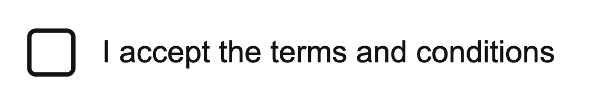 | 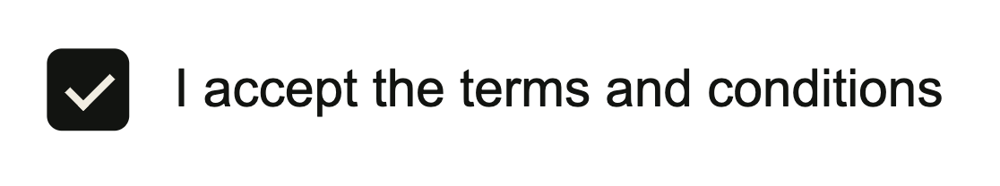 | 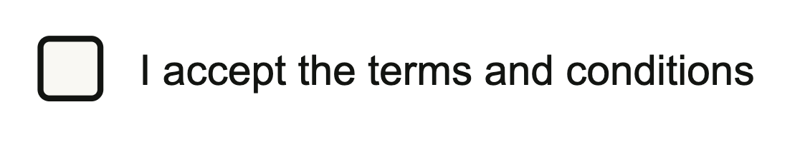 | 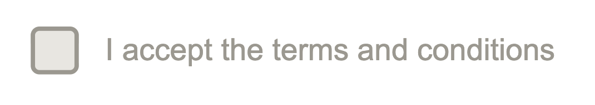 |

#### API (Inputs)

| Property | Type     | Required | Default | Description                                      |
| :------- | :------- | :------: | :-----: | :----------------------------------------------- |
| `id`     | `string` |    ✅    |    —    | Unique identifier for label and checkbox binding |
| `name`   | `string` |    ✅    |    —    | Field name used for form identification          |
| `label`  | `string` |    ❌    | `null`  | Text label displayed next to the checkbox        |

#### Usage

```html
<tndm-checkbox-component
  formControlName="rememberMe"
  id="remember-me"
  name="remember"
  label="Remember me on this device">
</tndm-checkbox-component>
```

---

## Action Components

### TndmButton

A high-performance, signal-based button component. It uses strict typing to ensure the button has either a label, an icon, or both, maintaining design consistency across the application.

#### Visual States

| Variant   | Default                                                            | Hover / Focus                                                    | Disabled                                                            | Pressed       | With Icon                                                          |
| :-------- | :----------------------------------------------------------------- | :--------------------------------------------------------------- | :------------------------------------------------------------------ | :------------ | :----------------------------------------------------------------- |
| Primary   |    |    | 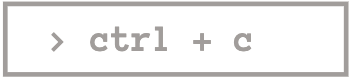   | `scale(0.97)` |  |
| Secondary |  | 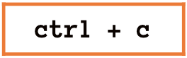 |  | `scale(0.97)` | `none`                                                             |
| Black     |      |      | 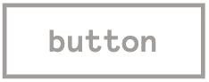     | `scale(0.97)` |    |
| Icon      | 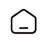      | 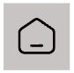      | 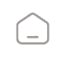      | `scale(0.97)` | -                                                                  |

#### API (Inputs & Outputs)

| Property    | Type                 | Required | Default | Description                                        |
| :---------- | :------------------- | :------: | :-----: | :------------------------------------------------- |
| `btnConfig` | `ButtonConfig`       |    ✅    |    —    | Configuration object for the button (see below)    |
| `clicked`   | `Output<MouseEvent>` |    ❌    |    —    | Emits native MouseEvent on click (if not disabled) |

#### ButtonConfig Properties

| Property     | Type                                             |   Default   | Description                                        |
| :----------- | :----------------------------------------------- | :---------: | :------------------------------------------------- |
| `label`      | `string`                                         |      —      | Button text (auto-formatted to Sentence case)      |
| `icon`       | [`IconType`](#shared-types)                      |      —      | Icon key from the internal `ICONS` library         |
| `variant`    | `'primary' \| 'secondary'  \| 'black' \| 'icon'` | `'primary'` | Visual style of the button                         |
| `size`       | `'sm' \| 'md'  \| 'lg' `                         |   `'md'`    | Size dimensions                                    |
| `isDisabled` | `boolean`                                        |   `false`   | Disables interaction and applies gray-scale styles |
| `type`       | `'button' \| 'submit'`                           | `'button'`  | Standard HTML button type.                         |

> **Note:** `ButtonConfig` is a union type. You must provide at least a `label` or an `icon`.

#### Configuration Types

The component enforces content rules via TypeScript:

- **Primary / Black**: label is required, icon is optional.
- **Secondary**: label is required, icon is forbidden (never).
- **Icon**: icon is required, label is forbidden (never).

#### Usage

```html
<!-- Primary button with text and icon -->
<tndm-button
  [btnConfig]="{
    label: 'get started',
    icon: 'home',
  }"
  (clicked)="onProceed($event)">
</tndm-button>

<!-- Small secondary button with icon only -->
<tndm-button
  [btnConfig]="{
    label: 'start',
    variant: 'secondary',
    size: 'sm'
  }">
</tndm-button>
```

#### Component Features

- **Smart Labeling**: The component uses a computed signal to manage typography consistency. A specific visual rule is applied to the Primary variant:

```ts
// If (variant === 'primary' && !icon)
'login'  =>  '> login'
```

- **Smart Click Handling**: The `clicked` output is protected by an internal check. It will **never** emit if `isDisabled` is set to `true`.
- **Form Integration**: When used inside a `<form>`, set the `type` property to `'submit'` in the `btnConfig` to trigger form submission.

#### Integration with Reactive Forms

To disable the button based on form status, bind the `isDisabled` property to the form's state:

```html
<tndm-button
  [btnConfig]="{
    label: 'save changes',
    variant: 'secondary',
    size: 'lg',
    isDisabled: profileForm.invalid || profileForm.pending
  }"
  type="submit">
</tndm-button>
```

---

### TndmToaster & ToastService

A global, signal-based notification system designed for stacking multiple alerts. Features automated lifecycle management (auto-dismiss).

#### Visual States

| State         | Success                                                       | Danger/Error                                            | Info                                                  | Warning                                                  |
| :------------ | :------------------------------------------------------------ | :------------------------------------------------------ | :---------------------------------------------------- | :------------------------------------------------------- |
| Default       | 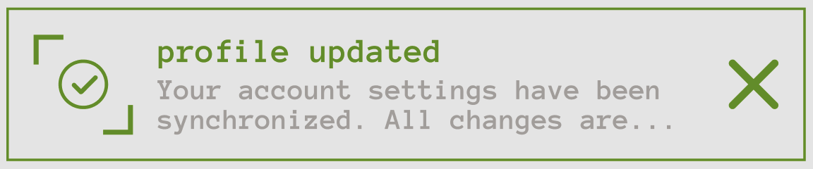      | 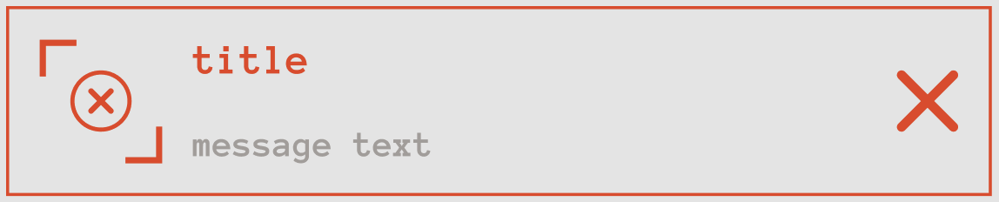 | 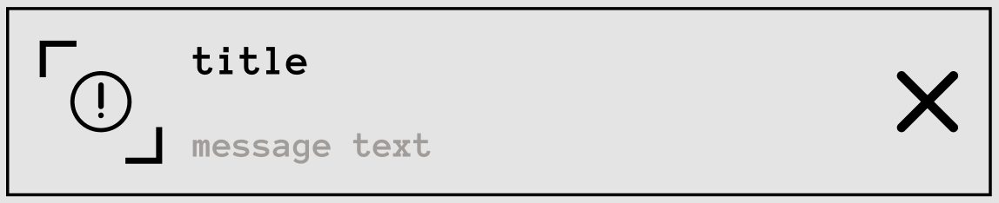 | 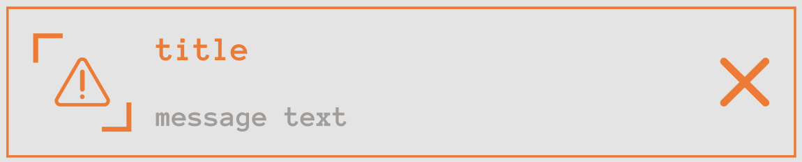 |
| Hover / Focus | 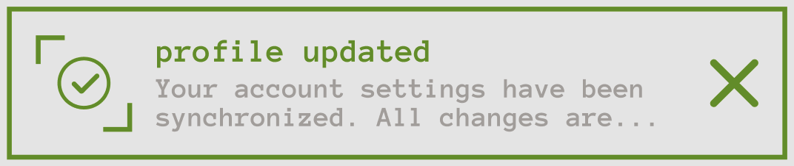        | — \|\| —                                                | — \|\| —                                              | — \|\| —                                                 |
| Opened        | 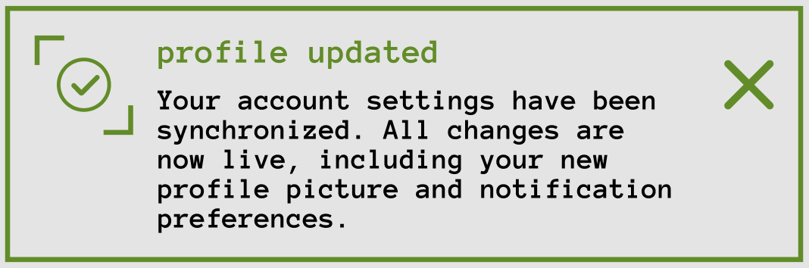       | — \|\| —                                                | — \|\| —                                              | — \|\| —                                                 |
| Without Icon  | 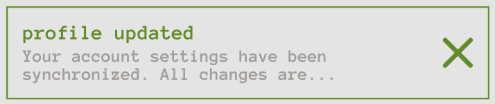 | — \|\| —                                                | — \|\| —                                              | — \|\| —                                                 |

#### Component Features

- **Accordion Logic:** Clicking a toast card expands the message. Clicking another card or anywhere outside the toaster automatically collapses the current message.
- **Accessibility:** Supports keyboard navigation via Tab and expansion via the Enter key.
- **Smart Scrolling:** Automatically scrolls to the newest toast using Angular effect and viewChild.
- **Typography:** heading is automatically transformed to lowercase via CSS.

#### Installation

1. **Include the toaster component in your root layout** (e.g., `app.html`):

```html
<tndm-toast />
```

2. **Inject the ToastService into your component or service**

```typescript
export class MyComponent {
  private toast = inject(ToastService);
}
```

#### Usage

**Basic Toasts**

```typescript
this.toast.success('Profile updated', 'Success');
this.toast.danger('System failure', 'Critical Error');
this.toast.info('New message received', '');
```

**Advanced Configuration**  
_Pass a ToastOptions object to override default behavior:_

```typescript
this.toast.warning('Warning', 'Check the answer', {
  duration: 2000,
  icon: false,
});
```

_To pass options without a message, you must provide an empty string as the second argument:_

```typescript
this.toast.warning('low battery', '', {
  duration: 2000,
  icon: false,
});
```

#### API Reference

**ToastService Methods**

| Method      | Arguments                                                   | Description                        |
| :---------- | :---------------------------------------------------------- | :--------------------------------- |
| `success`   | `(title: string, message?: string, options?: ToastOptions)` | Displays a success (green) toast.  |
| `danger`    | `(title: string, message?: string, options?: ToastOptions)` | Displays a danger (red) toast.     |
| `info`      | `(title: string, message?: string, options?: ToastOptions)` | Displays an info (black) toast.    |
| `warning``  | `(title: string, message?: string, options?: ToastOptions)` | Displays a warning (orange) toast. |
| `remove`    | `(id: number)`                                              | Removes a specific toast by ID.    |
| `removeAll` | —                                                           | Clears all active toasts.          |

**ToastOptions:**

| Option   | Type             | Default | Description                                               |
| :------- | :--------------- | :------ | :-------------------------------------------------------- |
| duration | `number \| null` | `5000`  | Time in ms before auto-dismissal. Set to null to disable. |
| icon     | `boolean`        | `true`  | Show/hide the state-specific icon.                        |

## Shared Types

**InputType:** `email | password | search | tel | text | url`  
**IconType:** `keyof typeof ICONS` (specific keys from the internal icon library)  
**ErrorGenerator**: `ErrorGenerator<T = unknown> = (name: string, context: T) => string`  
**ValidationMessages**: `ValidationMessages<T = unknown> = Record<string, ErrorGenerator<T> | string>`
